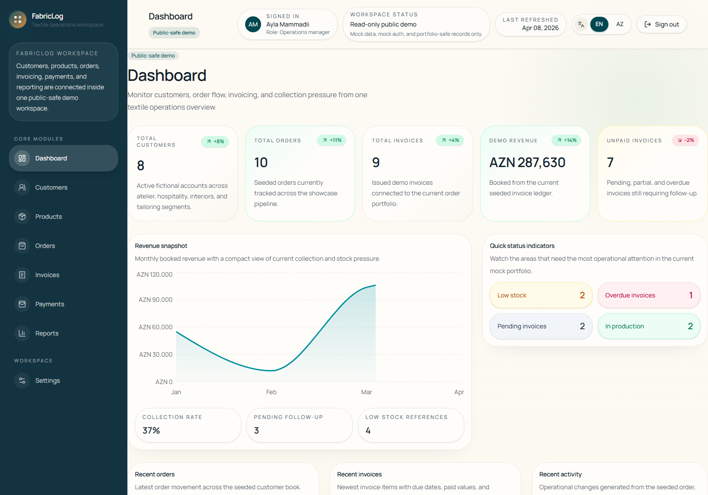
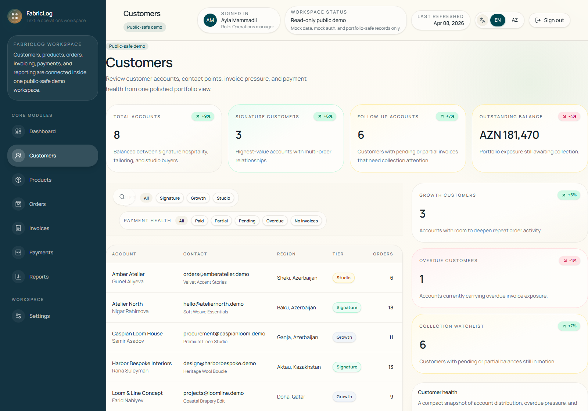

# FabricLog

FabricLog is a bilingual, portfolio-ready SaaS demo for a textile and fabric operations business. It presents a polished internal workspace for customer management, product cataloging, order tracking, invoicing, reporting, and record detail views using fictional sample data and a public-safe mock authentication flow.

## Why FabricLog

FabricLog is designed to demonstrate the kind of product thinking often expected in modern B2B SaaS work:

- a coherent operations dashboard rather than isolated screens
- realistic relationships across customers, products, orders, invoices, and payments
- bilingual UI support for English and Azerbaijani
- recruiter-friendly UX polish with tables, summaries, detail pages, and consistent empty/loading states
- a maintainable demo architecture that can later be swapped to real APIs and persistence

## Key Features

- Localized app experience with English and Azerbaijani routing and UI copy
- Mock authentication flow with protected app routes and demo-safe credentials
- Business dashboard with KPIs, activity feed, order and invoice previews, and reporting surfaces
- Searchable, filterable operational pages for customers, products, orders, and invoices
- Dedicated detail pages for customers, fabrics/products, orders, and invoices
- Public-safe demo dataset with believable but fictional textile business records
- Consistent SaaS design system built from reusable layout, table, badge, and panel components

## Screenshots

Add polished repository screenshots here before publishing. Recommended sections:

| Screen | Suggested File |
| --- | --- |
| Dashboard overview | `docs/screenshots/dashboard.png` |
| Customers portfolio view | `docs/screenshots/customers.png` |
| Product catalog | `docs/screenshots/products.png` |
| Orders and invoicing workflow | `docs/screenshots/orders-invoices.png` |
| Record detail experience | `docs/screenshots/detail-view.png` |
| Login screen | `docs/screenshots/login.png` |

Example markdown once screenshots are added:

```md


```

## Tech Stack

- **Framework:** Next.js 16 App Router
- **Language:** TypeScript
- **UI:** React 19, Tailwind CSS v4, shadcn/ui, Lucide icons
- **Internationalization:** next-intl
- **Tables and data presentation:** TanStack Table
- **Charts:** Recharts
- **Validation and typing:** Zod
- **Architecture:** server-side demo repository, mapper, and service layers

## What the Demo Includes

### Core Product Areas

- Dashboard
- Customers
- Products
- Orders
- Invoices
- Payments
- Reports
- Settings

### Detail Experiences

- Customer detail pages
- Product and fabric detail pages
- Order detail pages
- Invoice detail pages

## Running Locally

### Prerequisites

- Node.js 22 or later
- npm

### Setup

```bash
npm install
npm run dev
```

Open [http://localhost:3000](http://localhost:3000).

### Validation

```bash
npm run lint
npm run typecheck
npm run build
```

Or run the full verification sequence in one command:

```bash
npm run verify
```

## Mock Data and Demo Architecture

FabricLog uses a curated demo data layer instead of a real backend. The dataset is intentionally realistic enough to make the product feel credible, but every customer, company, invoice, payment, and activity entry is fictional.

The mock data is organized under `src/server/demo-data` and flows through a simple server architecture:

1. `demo-data` holds the seeded sample records.
2. `repositories` provide the base access layer.
3. `mappers` shape page-specific overview and detail payloads.
4. `services` supply the app routes with presentation-ready data.

This keeps the portfolio build public-safe while still showing a production-style data flow.

## Bilingual Support

FabricLog supports:

- English (`/en`)
- Azerbaijani (`/az`)

All major app views, auth screens, operational pages, and detail pages are localized through `next-intl`. The goal is to show how the product can support multilingual business teams without forking the UI.

## Demo Authentication

This repository uses **mock authentication only**. It is intentionally simple and suitable for a public portfolio project.

- Login route: `/{locale}/login`
- Protected routes: the authenticated app area under `/{locale}/...`
- Session model: demo-only cookie-based session

Public demo credentials:

- **Email:** `ayla@fabriclog.demo`
- **Password:** `FabricLog2026`

These values are intentionally public and should not be treated as secrets.

## Project Structure

```text
src/
  app/
    [locale]/
      (marketing)/
      (auth)/
      (app)/
    api/
  components/
    dashboard/
    data-table/
    forms/
    layout/
    navigation/
    shared/
    ui/
  features/
    auth/
    customers/
    dashboard/
    fabrics/
    invoices/
    orders/
    payments/
    products/
    reports/
    settings/
  lib/
    auth/
    constants/
    formatting/
    i18n/
  messages/
  server/
    demo-data/
    mappers/
    repositories/
    services/
  types/
public/
  brand/
  demo/
```

## Deployment

**Recommended platform:** Vercel

FabricLog is a Next.js App Router project with `next-intl`, middleware route protection, and dynamic authenticated pages, so Vercel is the cleanest deployment target for this public showcase.

### Deployment notes

- No secrets are required for the public demo
- `NODE_ENV` is set automatically by the host
- `SITE_URL` is optional and improves canonical metadata, `robots.txt`, and `sitemap.xml`
- Preview deployments are intended for review and are configured to stay `noindex`
- The production deployment is the intended public portfolio URL and can be indexed

### Recommended Vercel setup

1. Import the repository into Vercel
2. Keep the default Next.js build settings
3. Use Node.js 22+
4. Optionally add:

```bash
SITE_URL=https://your-demo-domain.com
```

### Local production check

```bash
npm run verify
npm run start
```

### Deploy flow

```bash
vercel
vercel --prod
```

## Public Demo Disclaimer

FabricLog is a **public showcase project**, not a production deployment.

- All business records are fictional.
- All customer and payment information is sample data.
- Authentication is mock-only.
- No external services, databases, or production credentials are required.

The repository is intentionally structured to be safe for public GitHub portfolio use.

## Why This Project Is Useful

FabricLog is useful as a portfolio project because it demonstrates more than just UI screens:

- product structure across multiple connected business domains
- operational UX for data-dense B2B workflows
- internationalization in a real app shell
- consistent design system usage across dashboards, tables, reports, and detail views
- a demo-safe architecture that still resembles real product layering

For recruiters or hiring managers, it provides a compact but credible example of frontend, full-stack shaping, information architecture, and product presentation quality.

## Future Improvements

- Replace the mock repository layer with a real database and API integration
- Add date-range filtering and export actions for reports
- Add role-based demo personas and richer permissions modeling
- Expand payment and invoice workflows with reminders and timeline actions
- Add screenshot assets, deployment links, and short product walkthrough media
- Add tests for key service mappers and route protection behavior

## Environment Notes

No secrets are required for the public demo. See [`.env.example`](./.env.example) for the minimal local environment reference.

Optional deployment env:

- `SITE_URL` for canonical metadata, sitemap, and robots output

The local Windows `spawn EPERM` issue seen in some sandboxed environments is a workstation/runtime quirk, not an application build blocker. A normal host build completes successfully.

## Portfolio Publishing Notes

Before publishing the repository:

- add final screenshots to the `Screenshots` section
- keep the public demo credentials clearly labeled as mock-only
- treat `/products` as the canonical catalog route
- confirm no local `.env` files or generated build output are tracked

## License

This repository includes a [LICENSE](./LICENSE) file. Review it before public distribution if you want to customize the project's licensing terms.
